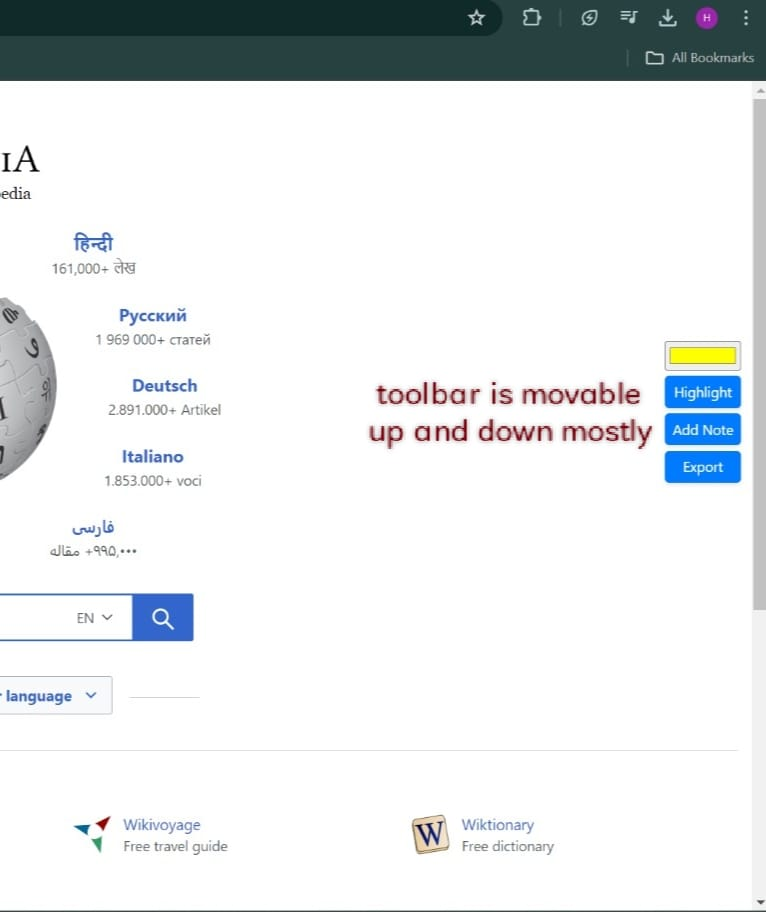
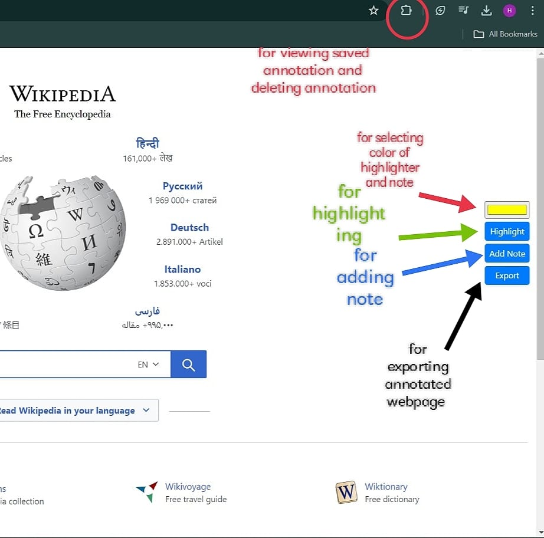
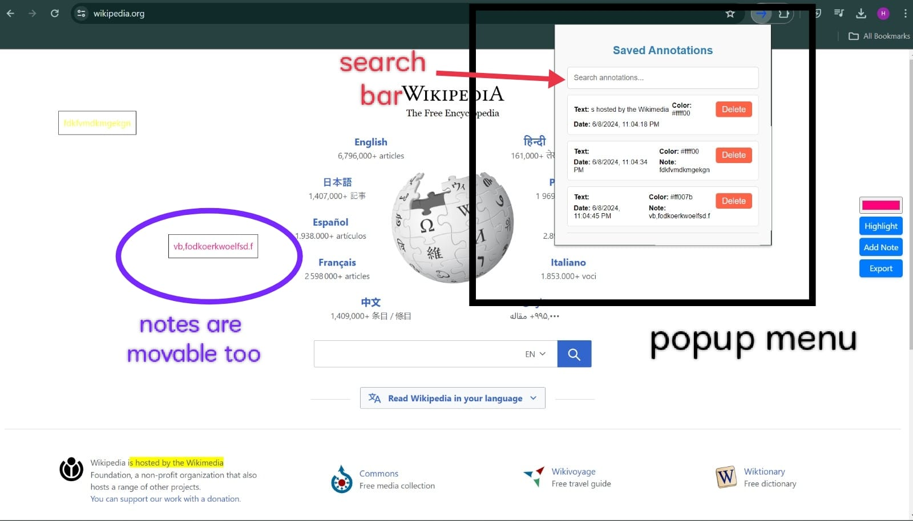

# Web Annotator

Web Annotator is a Chrome extension that allows users to annotate webpages with highlights and notes. This tool is perfect for anyone who wants to make notes or highlight important information directly on webpages.

## Features

- **Highlight Text**: Select text on a webpage and highlight it with your chosen color.
- **Add Notes**: Add movable notes to any part of a webpage.
- **Save Annotations**: Annotations are saved and can be viewed later.
- **Export Annotations**: Export the webpage with your annotations for offline use.
- **Popup Menu**:
  - **Search Annotations**: Use the search bar to find specific annotations.
  - **View Annotations**: Display a list of all saved annotations.
  - **Delete Annotations**: Delete specific annotations from the list.

## Installation

1. Clone or download this repository.
2. Open Chrome and go to `chrome://extensions/`.
3. Enable "Developer mode" at the top right corner.
4. Click "Load unpacked" and select the directory where you downloaded the repository.

## Usage

1. **Highlight Text**:
    - Click the "Highlight" button.
    - Select the text you want to highlight on the webpage.
    - The selected text will be highlighted with the chosen color.
    
2. **Add Notes**:
    - Click the "Add Note" button.
    - Enter your note in the prompt that appears.
    - A note will appear on the webpage, which you can drag to your desired location.
    
3. **Search Annotations**:
    - Click on the Web Annotator icon in the toolbar.
    - Use the search bar to find specific annotations.
    
4. **Export Annotations**:
    - Click the "Export" button to save the current state of the webpage with annotations.
    

## Files

- **manifest.json**: Defines the extension's metadata and permissions.
- **content.js**: Contains the main logic for highlighting text and adding notes.
- **popup.html**: The HTML file for the extension's popup interface.
- **popup.js**: Handles the display and search of annotations in the popup.

## content.js

This script handles the creation of highlights and notes on the webpage. It includes functions to create the toolbar, highlight text, add notes, save annotations, and load saved annotations.

## popup.html

This HTML file defines the structure of the extension's popup window, including the search input and list of saved annotations.

## popup.js

This script handles the logic for displaying and managing annotations within the popup. It includes functions to load, display, delete, and search annotations.

## Limitations
- **Highlight Accuracy**: Highlighting text across different elements or complex HTML structures might result in unexpected behavior.
- **Performance**: Having many annotations on a single page may impact the performance of the webpage.
- **Export**: exporting file in html format doesn't extract images and can't duplicate the complete website but saves all the annotations and their positions.

## References
1. Chrome Extension Documentation
2. Google Developers Guide
3. SaltyNote extension github repository
4. Youtube 
